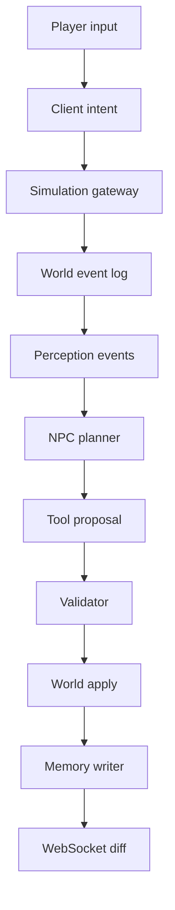

# World Simulation Spec

## 1. Purpose

The world simulation is the authoritative source of truth. It owns time, locations, NPC state, relationships, event state, and all durable consequences.

LLM output must not directly mutate the world. LLM output can only become world state through validated tools.

## 2. Simulation Model

Use an actor-per-world or worker-per-world model.

For the MVP, one process can own one world. This keeps mutation order deterministic and avoids race conditions between NPC decisions, player actions, and event progression.

## 3. World Tick

Recommended MVP tick:

- Logical tick: 1 game minute.
- Realtime tick interval: configurable, default 1-3 seconds per game minute.
- High-frequency movement can be interpolated client-side.

Each tick:

1. Advance world time.
2. Process due scheduled actions.
3. Process queued player intents.
4. Process event triggers.
5. Process NPC decision slots.
6. Apply validated world mutations.
7. Emit WebSocket state diff.
8. Queue async memory/reflection jobs if needed.

## 4. Core State Objects

### World

```json
{
  "world_id": "demo_world_001",
  "time": "09:10",
  "day": 1,
  "active_events": ["evt_missing_seeds"],
  "locations": ["square", "tavern", "farm", "workshop", "warehouse"],
  "npcs": ["mira", "tomo", "ivo"],
  "event_log_cursor": 120
}
```

### Location

```json
{
  "location_id": "tavern",
  "name": "Tavern",
  "capacity": 6,
  "tags": ["social", "gossip", "food"],
  "connected_locations": ["square", "warehouse"],
  "current_occupants": ["ivo", "mira"]
}
```

### NPC Runtime State

```json
{
  "npc_id": "mira",
  "current_location": "workshop",
  "current_action": "work",
  "current_goal": "maintain_order",
  "mood": "tense",
  "busy_until": "10:00",
  "last_decision_at": "09:05",
  "status_flags": ["concerned_about_seeds"]
}
```

### Relationship

```json
{
  "owner_id": "mira",
  "target_id": "tomo",
  "trust": 0.42,
  "affinity": 0.36,
  "fear": 0.08,
  "debt": 0,
  "last_changed_by_event_id": "evt_0132"
}
```

### World Event

```json
{
  "event_id": "evt_missing_seeds",
  "state": "active",
  "phase": "rumor",
  "facts": [
    {
      "fact_id": "fact_seed_bag_missing",
      "content": "The shared seed bag is missing.",
      "verified": true
    }
  ],
  "resolution_path": null,
  "involved_npcs": ["mira", "tomo", "ivo"]
}
```

## 5. Player Intent Flow

Player input must be normalized before entering simulation.



## 6. Intent Types

### talk

The player starts or continues dialogue with a nearby NPC.

Required fields:

- `speaker_id`
- `target_id`
- `message`
- `location_id`

### share_memory

The player intentionally tells one NPC a claim, memory, or fact.

Required fields:

- `speaker_id`
- `target_id`
- `topic`
- `claim_text`
- `source_reference`

### investigate

The player investigates a location or object.

Required fields:

- `actor_id`
- `target_location_id`
- `investigation_target`

### observe

The player requests local visible context.

Required fields:

- `actor_id`
- `location_id`

## 7. NPC Decision Slots

NPCs should not run unrestricted continuous reasoning.

Decision slots happen when:

- Schedule changes.
- A high-importance perception event arrives.
- A conversation ends.
- A rumor exceeds propagation threshold.
- An event phase changes.
- A cooldown expires.

For each decision slot:

1. Gather local context.
2. Retrieve relevant memory.
3. Score deterministic options.
4. Decide whether LLM is needed.
5. Create action proposal.
6. Validate proposal.
7. Apply or reject.

## 8. Deterministic Responsibilities

These must not depend on LLM:

- Time progression.
- Location reachability.
- Path validity.
- NPC schedule.
- Occupancy and conflicts.
- Cooldowns.
- Relationship arithmetic.
- Event phase transitions.
- Evidence discovery.
- Quest resolution state.
- Resource changes.

## 9. LLM Responsibilities

LLM may be used for:

- Natural dialogue wording.
- Rephrasing rumors.
- Social interpretation.
- Candidate action proposals in ambiguous contexts.
- Reflection summaries.
- Memory summaries.

LLM must return structured output when proposing actions.

## 10. WebSocket Events

### world_state

Sent after initial connection.

### world_diff

Sent after simulation tick or accepted mutation.

### dialogue_delta

Sent when generated dialogue text is available.

### event_log_entry

Sent when a meaningful event occurs.

### debug_trace

Development only. Includes planner, memory, validator, and LLM details.

## 11. Event Log

Every accepted world mutation writes an immutable event log entry.

```json
{
  "event_log_id": "elog_000120",
  "world_id": "demo_world_001",
  "timestamp": "09:12",
  "type": "relationship_changed",
  "actor_id": "mira",
  "target_id": "tomo",
  "source": "rumor_missing_seeds_01",
  "payload": {
    "trust_delta": -0.08,
    "reason": "Mira heard a rumor that Tomo took the seeds."
  }
}
```

## 12. Failure Handling

### LLM Timeout

- Keep simulation running.
- Use deterministic fallback or template text.
- Mark debug trace with `llm_fallback_used: true`.

### Validator Rejection

- Do not mutate world state.
- Log rejection reason.
- Optionally return in-character fallback dialogue.

### Client Disconnect

- Continue world simulation only if configured.
- For MVP, pause world if no active player is connected.

## 13. Test Requirements

- Deterministic replay of event log produces same world state.
- Invalid location movement is rejected.
- NPC cannot talk to target in another location unless tool explicitly supports remote communication.
- Relationship changes always reference an event source.
- Event phase cannot skip required evidence gates.

